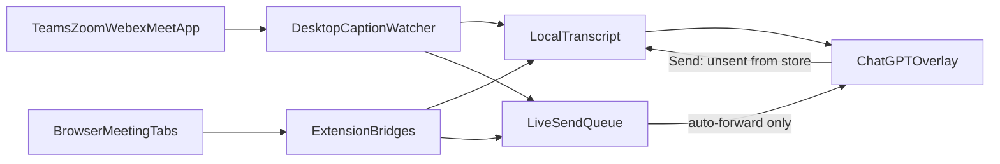

# Architecture

Dictate splits **capture**, **storage**, and **ChatGPT delivery**.



## Components

| Component | Path | Role |
|-----------|------|------|
| Shared helpers | [`caption-utils.js`](../caption-utils.js) | Normalize, dedupe, unsent chunking, `CaptionQueue`. Loaded in the extension **before** the meeting core; required by Electron via [`CaptionQueue.js`](../dictate-desktop/electron/CaptionQueue.js). |
| Meeting core | [`meeting-bridge-core.js`](../meeting-bridge-core.js) | Caption scan, persist, Send, auto-forward, ChatGPT forward. |
| Platform adapters | `teams-bridge.js`, `meet-bridge.js`, `zoom-bridge.js`, `webex-bridge.js` | DOM selectors and “turn on captions” per product. |
| Background | [`background.js`](../background.js) | Inject bridges, route `sendMeetingQueue` to a meeting tab, talk to the desktop bridge. |
| ChatGPT page | [`content-script.js`](../content-script.js) | Dictation auto-send and composer injection. |
| Desktop shell | [`dictate-desktop/electron/`](../dictate-desktop/electron/) | Overlay `webview` (ChatGPT), IPC, caption watcher, transcript files. |
| Overlay UI | [`dictate-desktop/renderer/overlay/`](../dictate-desktop/renderer/overlay/) | Send, Transcript copy, ChatGPT frame. |
| Settings UI | [`dictate-desktop/renderer/settings/`](../dictate-desktop/renderer/settings/) | Undetectable, bridge toggle, transcript preview / export / end call. |

## Two stores

**Transcript** (full call, up to 20,000 lines):

- Desktop: `{userData}/transcripts/current.json` plus dated `.txt` on End call.
- Extension: `chrome.storage.local.meetingTranscript`.
- While Dictate Desktop is up, the extension POSTs `appendTranscript` so both sources share one desktop file.

**Live queue** (~300–400 lines): in-memory only. Used for auto-forward and “N new captions” hints. Trimming this queue must **not** delete transcript lines.

Each transcript line looks like:

```json
{
  "at": 1710000000000,
  "author": "Ada",
  "text": "What is the deadline?",
  "platform": "teams",
  "source": "desktop",
  "sent": false
}
```

`sent: true` means ChatGPT already received that line (manual Send or auto-forward). Growing a live caption updates `text` in place and does **not** clear `sent`.

## Send

1. Overlay **Send** (`overlay-send` in [`ipcHandlers.js`](../dictate-desktop/electron/ipcHandlers.js)) takes the oldest **unsent** transcript lines, formats `Author: text` (no timestamps), and injects them into the ChatGPT `webview`.
2. On success those lines are marked `sent`. The live queue is marked too so auto-forward does not repeat them.
3. If the payload would exceed ~20,000 characters, only the oldest chunk goes; remaining unsent lines wait for the next Send.
4. If the desktop transcript is empty, Send falls back to the extension (`sendMeetingQueue`), which reads `meetingTranscript` the same way.

Auto-forward (questions / sentences) still uses the live queue, then marks the matching transcript lines sent.

## Desktop caption watcher

[`DesktopCaptionWatcher.js`](../dictate-desktop/electron/DesktopCaptionWatcher.js):

- **Windows:** [`native/windows-captions.ps1`](../dictate-desktop/native/windows-captions.ps1) UI Automation. Platform `meet` when the window title matches Google Meet / `meet.google.com` / `Meet - …`. Chrome and Edge are included only when that title gate matches.
- **macOS:** Accessibility via `osascript`. Chrome / Edge / Google Meet processes; text is taken only from windows whose name contains Meet or `meet.google.com`.
- Identical caption snapshots are skipped so the 900ms poll does not rewrite the transcript.

## Local bridge

Dictate Desktop listens on **`http://127.0.0.1:38473`** ([`BridgeServer.js`](../dictate-desktop/electron/BridgeServer.js)).

| Method | Path | Purpose |
|--------|------|---------|
| GET | `/health` | Extension detects that the desktop app is running. |
| GET | `/pending` | Actions queued for a meeting tab (e.g. `sendMeetingQueue`). |
| POST | `/bridge` | JSON `{ action, ... }` handled by [`BridgeRouter.js`](../dictate-desktop/electron/BridgeRouter.js). |

Useful actions: `appendTranscript`, `markTranscriptSent`, `getTranscript`, `endTranscript`, `forwardToChatGPT`, `sendMeetingQueue` (queued for the tab).

CORS is open for localhost so content scripts may call it. Nothing is exposed off-loopback.

## Overlay ChatGPT

The overlay is a `BrowserWindow` with a `<webview src="https://chatgpt.com">`. Guest scripts (`chatgpt-preload.js`, `content-script.js`) fill the composer. Replies stay in the ChatGPT UI; they are not copied into a side pane.

## Adding a meeting platform

See the checklist at the top of [`meeting-bridge-core.js`](../meeting-bridge-core.js): manifest matches, `background.js` `MEETING_PLATFORMS`, adapter file, then a manual caption + Send test.
